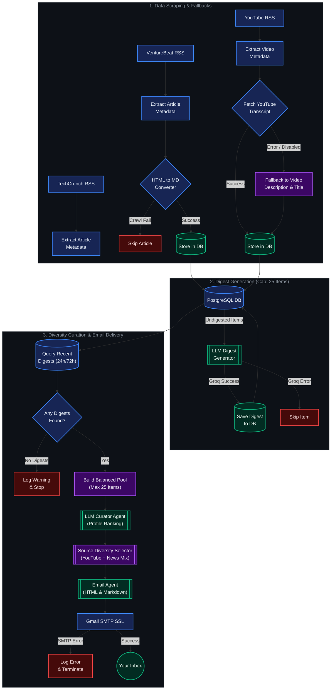

# Morning Synapse 🌅

> **Your Personalized, AI-Curated Daily News Digest**

Morning Synapse is an intelligent, automated news aggregation and curation pipeline. It tracks tech publications and YouTube channels, extracts transcripts (with description fallbacks), ranks content using a personalized AI Curator Agent with source-diversity reranking, and delivers a beautifully formatted daily news summary directly to your inbox.

---

## 🚀 Key Features

*   **Multi-Source Scraper**: Tracks articles and videos from sources like YouTube channels, TechCrunch (AI category), and VentureBeat.
*   **Transcript & Description Fallback**: Automatically extracts YouTube video transcripts, seamlessly falling back to video descriptions if transcripts are unavailable so video content is never missed.
*   **Personalized Curator Agent**: Ranks articles and videos dynamically based on your interests and preferences defined in your user profile.
*   **Source Diversity Reranker**: Enforces a balanced mix of YouTube video summaries, tech news, and venture updates in the top 10 email output.
*   **Expanded Pipeline Capacity**: Capable of processing up to 25 digests per daily run for comprehensive news coverage.
*   **Beautiful Email Deliverability**: Formats selected top articles into a structured, elegant email digest containing both HTML and plain-text versions.
*   **Fully Automated**: Features a ready-to-use GitHub Actions workflow configured to deliver your digest daily at **8:00 AM IST**.

---

## 📁 Project Architecture



### 🛡️ Pipeline Fallbacks & Resilience

*   **YouTube Transcript Fallback**: If a video lacks transcripts or the API call encounters rate limits, the pipeline automatically falls back to using the video's description and title. This guarantees YouTube videos are processed for digests even without captions.
*   **VentureBeat Scraping Fallback**: If crawling the full article text fails, the scraper gracefully falls back or skips the item without halting the pipeline.
*   **Source-Balanced Curation & Diversity**: The curation engine fetches a balanced pool across all active source types (YouTube, TechCrunch, VentureBeat) and enforces source diversity during final selection. This ensures your daily email contains a rich mix of video summaries and written news articles rather than being dominated by a single source.
*   **Expanded Digest Capacity**: Processes up to 25 digests per daily pipeline run to cover recent uploads across all tracked channels and tech feeds.
*   **LLM API Resilience**: During digest generation, individual failures (e.g. rate limits or server errors from the Groq API) are caught per article and skipped, allowing the rest of the queue to process.
*   **Empty Digest Safety**: If no new digests are available for the day, the email service catches the `ValueError`, logs a warning, and stops execution cleanly rather than sending an empty digest email.

---

## 🛠️ Local Setup

### Prerequisites
*   Python 3.12+
*   [uv](https://github.com/astral-sh/uv) (recommended fast Python package installer)
*   PostgreSQL 17

### 1. Clone & Install Dependencies
Ensure you have `uv` installed, then run:
```bash
# Sync dependencies and set up virtual environment
uv sync
```

### 2. Configure Environment Variables
Create a `.env` file in the root directory (based on the template below):
```ini
GROQ_API_KEY=your-groq-api-key
MY_EMAIL=your-recipient-and-sender-email@gmail.com
APP_PASSWORD=your-gmail-app-password

# Database Configuration
POSTGRES_USER=postgres
POSTGRES_PASSWORD=your-postgres-password
POSTGRES_DB=ai_news_aggregator
POSTGRES_HOST=localhost
POSTGRES_PORT=5432
```

### 3. Spin up the Database
If you prefer running PostgreSQL via Docker, you can use the provided compose configuration:
```bash
docker compose -f docker/docker-compose.yml up -d
```

### 4. Setup Tables & Run
Run the initial schema creation followed by the pipeline:
```bash
# Create database tables
uv run app/database/create_tables.py

# Run the pipeline locally
uv run main.py
```

---

## ⚙️ Configuration & Customization

### RSS Sources & Channels
You can add or remove tracked YouTube channel IDs in:
*   [`app/config.py`](file:///c:/Users/uday%20raj%20nkashyap/Desktop/AI%20News%20Aggregator/app/config.py)

### Your Curation Profile
To tailor the AI curation to your specific interests (e.g., focus on LLMs, agentic workflows, robotics, or general tech), edit your preferences in:
*   [`app/profiles/user_profile.py`](file:///c:/Users/uday%20raj%20nkashyap/Desktop/AI%20News%20Aggregator/app/profiles/user_profile.py)

---

## 🤖 Automated Delivery (GitHub Actions)

This project is pre-configured with a daily email trigger. The workflow runs at **2:30 AM UTC** (which is exactly **8:00 AM IST**).

To enable this:
1. Push your code to your GitHub Repository.
2. Go to **Settings -> Secrets and variables -> Actions** in your GitHub repository.
3. Add the following three secrets:
    *   `MY_EMAIL`: The recipient/sender Gmail address.
    *   `APP_PASSWORD`: The Google App-specific password.
    *   `GROQ_API_KEY`: Your Groq API key.
