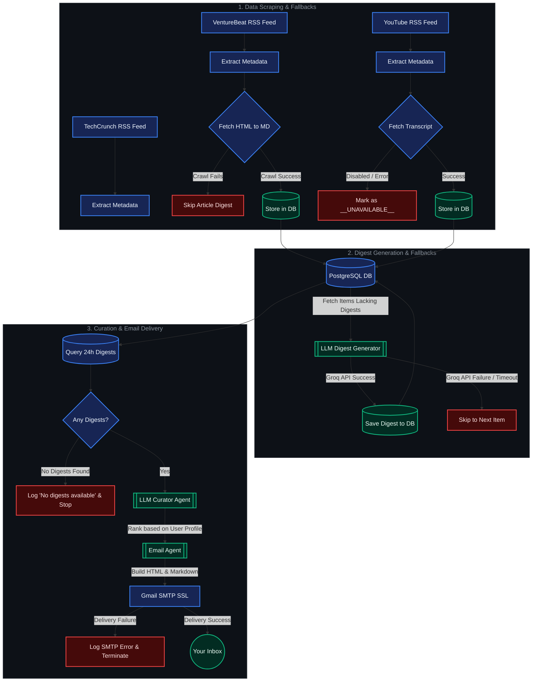

# Morning Synapse 🌅

> **Your Personalized, AI-Curated Daily News Digest**

Morning Synapse is an intelligent, automated news aggregation and curation pipeline. It tracks tech publications and YouTube channels, extracts transcripts, ranks content using a personalized AI Curator Agent, and delivers a beautifully formatted daily news summary directly to your inbox.

---

## 🚀 Key Features

*   **Multi-Source Scraper**: Tracks articles and videos from sources like YouTube channels, TechCrunch (AI category), and VentureBeat.
*   **Transcript Extraction**: Extracts YouTube video transcripts automatically to summarize video content alongside written articles.
*   **Personalized Curator Agent**: Ranks articles and videos dynamically based on your interests and preferences defined in your user profile.
*   **Beautiful Email Deliverability**: Formats the selected top articles into a structured, elegant email digest containing both HTML and plain-text versions.
*   **Fully Automated**: Features a ready-to-use GitHub Actions workflow configured to deliver your digest daily at **8:00 AM IST**.

---

## 📁 Project Architecture



### 🛡️ Pipeline Fallbacks & Resilience

*   **YouTube Transcript Failure**: If a video lacks transcripts or the API call fails, the pipeline marks it as `__UNAVAILABLE__` to prevent redundant retries. The runner handles this gracefully without interrupting other videos.
*   **VentureBeat Scraping Failure**: If crawling the article text fails, the scraper skips that article instead of halting the program.
*   **LLM API Resilience**: During digest generation, individual failures (e.g. rate limits or server errors from the Groq API) are caught per article and skipped, allowing the rest of the queue to process.
*   **Empty Digest Fallback**: If no new digests are available for the day, the email service catches the `ValueError`, logs a warning, and stops the execution cleanly rather than sending an empty digest email.

---

## 🛠️ Local Setup

### Prerequisites
*   Python 3.12+
*   [uv](https://github.com/astral-sh/uv) (recommended fast Python package installer)
*   PostgreSQL 17

### 1. Clone & Install Dependencies
Ensure you have `uv` installed, then run:
```bash
# Sync dependencies and set up virtual environment
uv sync
```

### 2. Configure Environment Variables
Create a `.env` file in the root directory (based on the template below):
```ini
GROQ_API_KEY=your-groq-api-key
MY_EMAIL=your-recipient-and-sender-email@gmail.com
APP_PASSWORD=your-gmail-app-password

# Database Configuration
POSTGRES_USER=postgres
POSTGRES_PASSWORD=your-postgres-password
POSTGRES_DB=ai_news_aggregator
POSTGRES_HOST=localhost
POSTGRES_PORT=5432
```

### 3. Spin up the Database
If you prefer running PostgreSQL via Docker, you can use the provided compose configuration:
```bash
docker compose -f docker/docker-compose.yml up -d
```

### 4. Setup Tables & Run
Run the initial schema creation followed by the pipeline:
```bash
# Create database tables
uv run app/database/create_tables.py

# Run the pipeline locally
uv run main.py
```

---

## ⚙️ Configuration & Customization

### RSS Sources & Channels
You can add or remove tracked YouTube channel IDs in:
*   [`app/config.py`](file:///c:/Users/uday%20raj%20nkashyap/Desktop/AI%20News%20Aggregator/app/config.py)

### Your Curation Profile
To tailor the AI curation to your specific interests (e.g., focus on LLMs, agentic workflows, robotics, or general tech), edit your preferences in:
*   [`app/profiles/user_profile.py`](file:///c:/Users/uday%20raj%20nkashyap/Desktop/AI%20News%20Aggregator/app/profiles/user_profile.py)

---

## 🤖 Automated Delivery (GitHub Actions)

This project is pre-configured with a daily email trigger. The workflow runs at **2:30 AM UTC** (which is exactly **8:00 AM IST**).

To enable this:
1. Push your code to your GitHub Repository.
2. Go to **Settings -> Secrets and variables -> Actions** in your GitHub repository.
3. Add the following three secrets:
    *   `MY_EMAIL`: The recipient/sender Gmail address.
    *   `APP_PASSWORD`: The Google App-specific password.
    *   `GROQ_API_KEY`: Your Groq API key.
